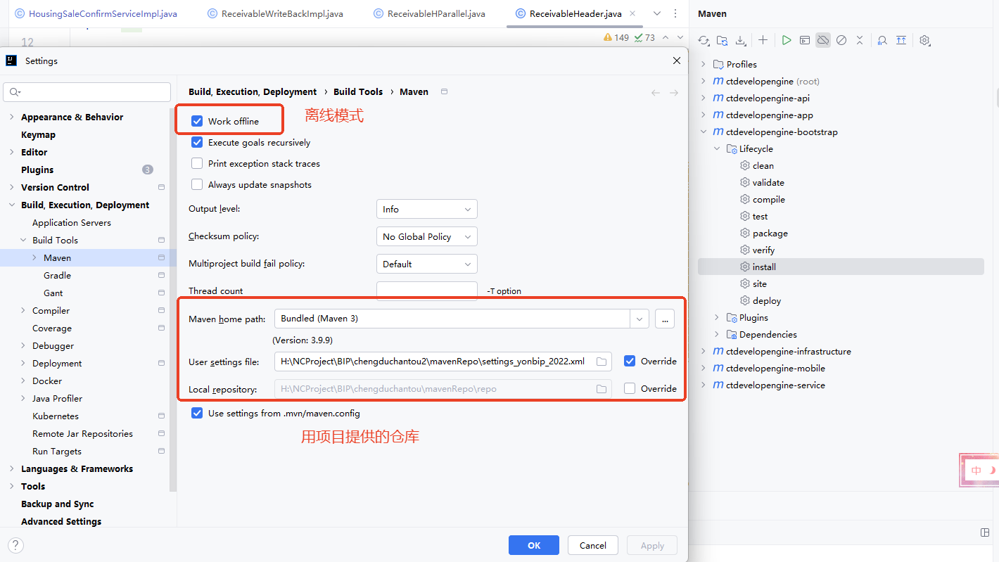
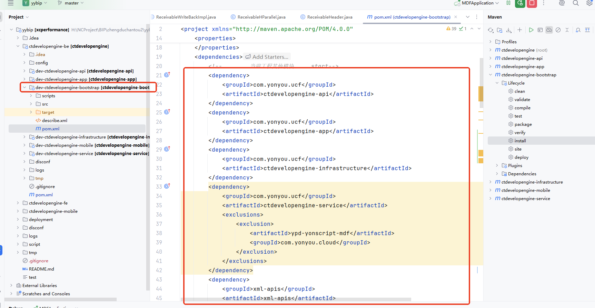
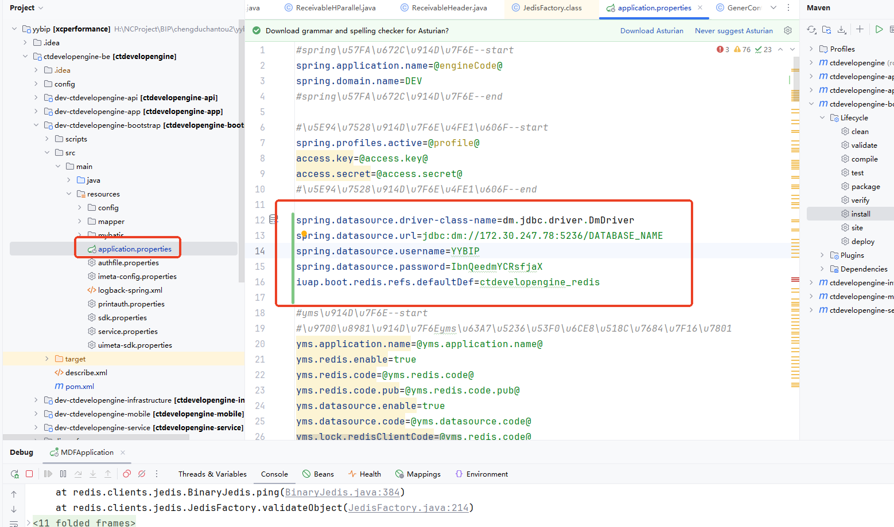
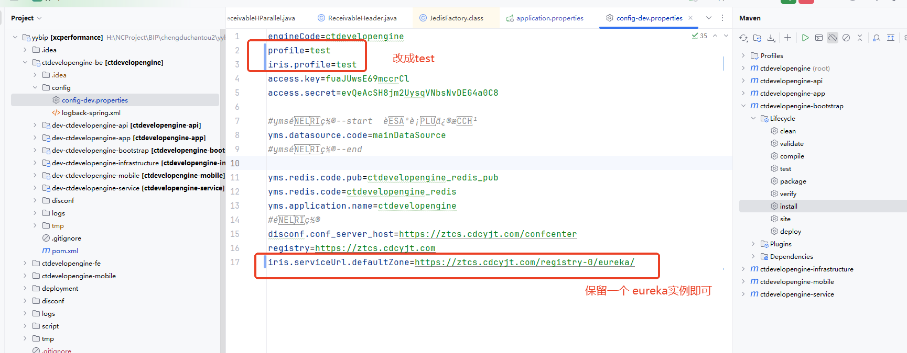
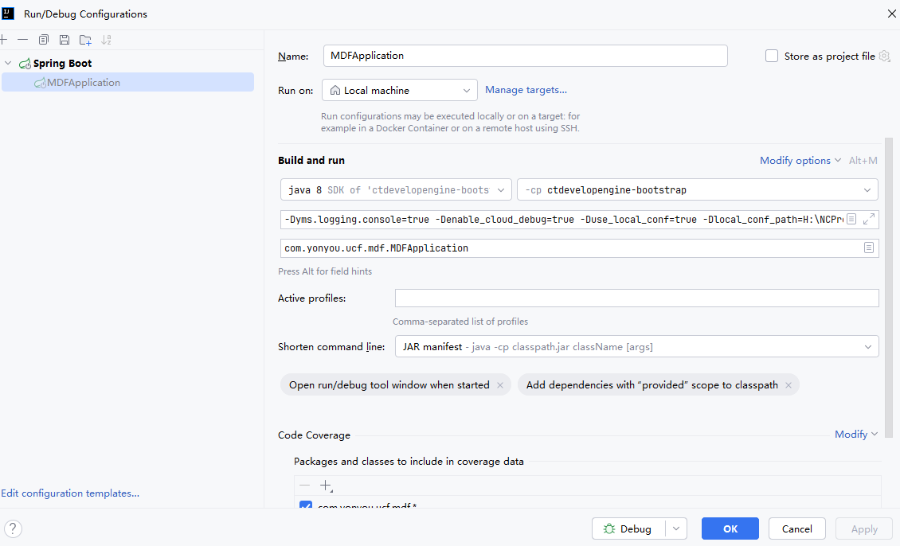
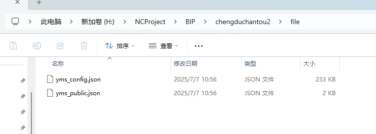
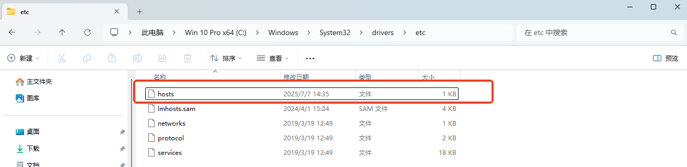
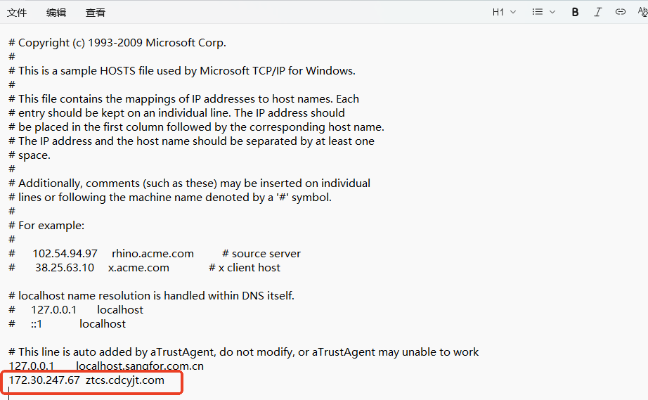

# 本文档内，涉及到图片，请主动获取图片内容。获取可以使用skill中的脚本 parse_image.py


## 首先确认用户使用什么工具搭建？ YDS工具还是 IDEA?


# 旗舰版环境搭建  V3 R6以下版本，使用IDEA搭建

## 更换maven仓库，启用离线模式




## 修改pom文件



## 修改 属性配置文件



```properties
# 数据库 根据自己实际需要修改
spring.datasource.driver-class-name=dm.jdbc.driver.DmDriver
spring.datasource.url=jdbc:dm://10.63.245.138:5236/DATABASE_NAME
spring.datasource.username=YYBIP
spring.datasource.password=YYbip123
#redis 开发环境一般都没有redis，配不配随意了。
iuap.boot.redis.refs.defaultDef = XXX
```


## 修改  config配置文件




## 启动参数



```
-Dyms.logging.console=true
-Denable_cloud_debug=true
-Dapp.version=zht
-Duse_local_conf=true
-Dlocal_conf_path=H:\NCProject\BIP\chengduchantou2\file\  -- 这个路径是 两个yms配置文件所在的地方，注意最后的  \ 
                                                            配置文件这个不是所有项目都需要的！
-Dmw_profiles_active=test

```




## 配置host

1. 再配置下hosts

172.30.247.67  ztcs.cdcyjt.com






## rebuild 工程  和  重新构建maven clean 然后 install

 


## 标准后端工程搭建

[YonBIP社区文档中心](https://c2.yonyoucloud.com/iuap-hc-client/ucf-wh/client/index.html#/detail/BDHJDJ11?nodeId=bff1e3dd-8f68-46c4-8c3a-7c11d8c7bfdd&docId=25c9304a-652b-4709-9872-50ab8539ff30&productline=CommunityDoc)


# 旗舰版环境搭建 V3 R6  及以上，使用YDS工具搭建

